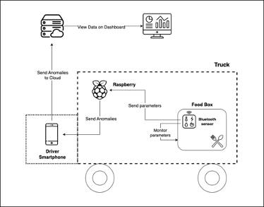

# FrontEndIoT

## Dashboard Front End

Attraverso dei grafici presenti nell’applicazione web è possibile monitorare sia l’andamento degli “alert” che si sono presentati durante una corsa passata, o monitorare in diretta una corsa ancora attiva.

Attraverso la seguente pagina è possibile visualizzare lo storico delle corse ed i relativi dati. Nel caso di corse passate è possibile visualizzare il dato “End Clock” che indica l’orario di fine della corsa; invece, nel caso di corse ancora attive sarà presente la scritta “Running…”.
Una volta dopo aver cliccato sulla corsa da noi interessata, potremmo visualizzare i dati della corsa ed i relativi “Scatter Plot” che rappresentano le anomalie che si sono presentate. Le linee verdi presenti su ogni grafico indicano i valori soglia che si erano impostati all’attivazione della corsa dall’operatore.

## Architettura
L’architettura scelta è composta dalle seguenti componenti:

  ●	Nordic Thingy:52: questo è il dispositivo alla base del prototipo che si occupa delle misurazioni dei valori ambientali, e dell’invio di queste tramite BLE al Raspberry Pi. 
  
  ●	Raspberry Pi: Il Raspberry Pi riceve i dati misurati dal Thingy via BLE, e li analizza. Se questo trova delle anomalie dei valori rispetto ai range prestabiliti, invia questa informazione tramite WebSocket al gateway (ovvero lo smartphone del conducente).  
  
  ●	Smartphone del conducente: Il telefono del conducente ha il ruolo di gateway. Sullo smartphone gira un applicazione che permette di avviare una corsa, farla terminare, e ricevere tutte le anomalie riscontrate. Ogni volta che riceve l’informazione di un'anomalia via WebSocket da parte del Raspberry, la notifica al conducente, e la comunica alla dashboard in cloud.
  
  ●	Dashboard: La dashboard mette a disposizione un'interfaccia utente che consente di visualizzare i dati raccolti dal sistema IoT in modo chiaro e comprensibile. Attraverso la dashboard, gli utenti possono monitorare lo stato dei parametri rilevati per visualizzare eventuali anomalie. La dashboard offre funzionalità avanzate come grafici interattivi e filtri per migliorare la comprensione dei dati. 
  
  ●	Cloud: Il cloud rappresenta l'infrastruttura server remota che ospita i servizi di backend necessari per la web application con l’obiettivo di mostrare le dashboard dei percorsi. 

  

  
Questa architettura permette una comunicazione efficiente tra i diversi componenti del sistema, consentendo una gestione tempestiva delle anomalie rilevate dai sensori. I dati vengono acquisiti, analizzati, inviati al telefono del conducente, e infine archiviati e visualizzati nel cloud attraverso una dashboard intuitiva.

## Collegamenti agli altri componenti
- [WOT - Ionic App](https://github.com/UniSalento-IDALab-IoTCourse-2022-2023/wot-project-2022-2023-ionicApp-Mele)
- [WOT - Front End Dashboard](https://github.com/UniSalento-IDALab-IoTCourse-2022-2023/wot-project-2022-2023-FrontEndAngular-Mele)
- [WOT - Back End Dashboard](https://github.com/UniSalento-IDALab-IoTCourse-2022-2023/wot-project-2022-2023-webapp-backend-DeNunzio)
- [WOT - Back End Raspberry (Nordic)](https://github.com/UniSalento-IDALab-IoTCourse-2022-2023/wot-project-backend-nordic-pi-DeNunzio)
  

Per avviare il progetto andare nella cartella di root e scrivere nel terminale: `ng serve`. Il server è visibile su `http://localhost:4200/`.
